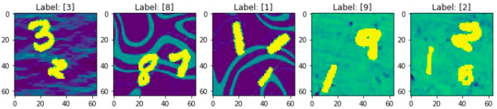

# Modified MNIST Classification
In this project, we want to classify modified MNIST dataset using Convolutional Neural Networks in Keras. 
## Dataset
Modified MNIST is a modified version of original MNIST where there is more than one hand-written number to identify. The task is to find the largest number in each image, in terms of pixels occupied. As an example, see the following picture with their correspoding labels on top:
<tr>
  

The whole trianing and test set images are stored in a separate .pkl file. We have also included the preprocessed images where the biggest number has beed exported as a new image. If you want to preprocess the original images yourself, you can downlaod them here:

* [Training set-original.pkl](https://drive.google.com/open?id=1CKJrLotDCjgrjGVEC0FhgibW5FNfybP5)
* [Training set labels](https://drive.google.com/open?id=1yIKz0MB6KrhSfOBHhvXj9B5cbeM5SPRN)
* [Test set-original.pkl](https://drive.google.com/open?id=1Xjfhc0xTe8D2608jotiJGje27i6tqn2l)
* [Training set-preprocessed.pkl](https://drive.google.com/open?id=1agQ1OCCYH9b1DjomL7frSbHgWuzwubIH)
* [Test set-preprocessed.npy](https://drive.google.com/open?id=1tMGiYMrXty_Kb5m1H0iVgH_dxP-qa9Wi)

After downloading the files above, create a new folder named "data" in the main folder and copy all the files in there.

## Getting Started
First of all, you need to download the repository.
```
git clone https://github.com/PouriaCh/Modified-MNIST-Deep-Learning.git
```
### Prerequisites
Make sure you install all the following packages in your environment:
* NumPy
* Pandas
* Keras-gpu
* Pickle
* Matplotlib
* Scikit-Learn
* future
### Experiments
You can choose from three deep convolutional models from "models.py". 
## Acknowledgement
This project has been done as part of the COMP551 (Applied Machine Learning) in McGill University.
